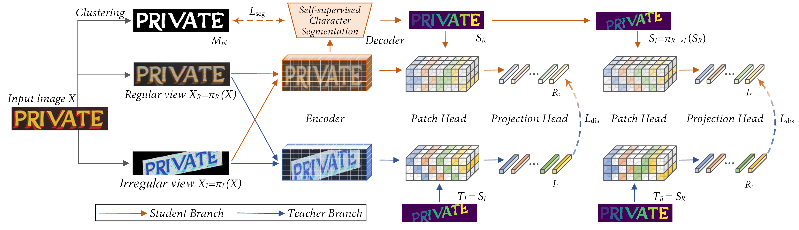

# Self-supervised Character-to-Character Distillation for Text Recognition （ICCV23）
This is the official code of "Self-supervised Character-to-Character Distillation for Text Recognition". 
For more details, please refer to our [paper](https://openaccess.thecvf.com/content/ICCV2023/papers/Guan_Self-Supervised_Character-to-Character_Distillation_for_Text_Recognition_ICCV_2023_paper.pdf) or [中文解读](https://zhuanlan.zhihu.com/p/644350078) or [poster](https://github.com/TongkunGuan/CCD/blob/main/graph/ICCV23_poster.pdf). If you have any questions please contact me by email (gtk0615@sjtu.edu.cn).

We also released CVPR23 work on scene text recognition:
- Self-Supervised Implicit Glyph Attention for Text Recognition (SIGA)
[Paper](https://openaccess.thecvf.com/content/CVPR2023/papers/Guan_Self-Supervised_Implicit_Glyph_Attention_for_Text_Recognition_CVPR_2023_paper.pdf) and [Code](https://github.com/TongkunGuan/SIGA)


## Pipeline 
<center>

</center>

## Model architecture


## Environments
```bash
# 3090 Ubuntu 16.04 Cuda 11
conda create -n CCD python==3.7
source activate CCD
conda install pytorch==1.10.0 torchvision==0.11.0 torchaudio==0.10.0 cudatoolkit=11.3 -c pytorch -c conda-forge
# The following optional dependencies are necessary
please refer to requirement.txt
pip install tensorboard==1.15.0
pip install tensorboardX==2.2
```

## Pretrain
```bash
# We recommend using multiple 3090s for training.
CUDA_VISIBLE_DEVICES=0,1,2,3 python -m torch.distributed.launch --nproc_per_node=4 train.py --config ./Dino/configs/CCD_pretrain_ViT_xxx.yaml
```
## Finetune
```bash
#update model.pretrain_checkpoint in CCD_vision_model_xxx.yaml
CUDA_VISIBLE_DEVICES=0,1 python train_finetune.py --config ./Dino/configs/CCD_vision_model_xxx.yaml
```
## Test
```bash
#update model.checkpoint in CCD_vision_model_xxx.yaml
CUDA_VISIBLE_DEVICES=0 python test.py --config ./Dino/configs/CCD_vision_model_xxx.yaml
```
## Weights
- Pretrain: [CCD-ViT-Small,3090](https://drive.google.com/file/d/1oQGB0tGLDK6TNOb-o1zytAnM_BldmOwM/view?usp=drive_link) Finetune: [ARD,3090](https://drive.google.com/file/d/1CoG0iHmMMs7aQqmM_qilql6YzsGm3096/view?usp=drive_link) and [STD,3090](https://drive.google.com/file/d/1MPX5sKGTftYO5rJwseWWjTcm6KU3UrVA/view?usp=drive_link)
<!-- - Since the server is under maintenance, CCD-ViT-Base will be released soon. -->
<!-- | Data     | IIIT | SVT | IC13 | IC15 | SVTP | CUTE | COCO |  CTW |   TT | HOST | WOST |
|----------|------|-----|------|------|------|------|------|------|------|------|------|
| STD |96.8 | 94.4 | 96.6 | 87.3 | 91.3 | 92.4 | 64.7 | 80.4 | 82.1 | 77.9 | 85.8 |
| ARD |98.0 | 96.4 | 98.3 | 90.3 | 92.7 | 98.3 | 76.7 | 86.5 | 91.3 | 77.3 | 86.0 | -->

- pretrain: [CCD-ViT-Base,3090](https://drive.google.com/file/d/18CybI4emJ1LWPBj6wFZ51Zy_FmQgfkn5/view?usp=drive_link) Finetune:[ARD,v100](https://drive.google.com/file/d/1m9rHR2XMH38deKFH8yTF7HMXs24XsgyL/view?usp=drive_link) and [STD,3090](https://drive.google.com/file/d/11flrSYD4KqIlFkbEzHwOm3akCmqX3kBE/view?usp=drive_link)
<!-- path: /data/TongkunGuan/SSL/DinoSTR_v6/saved_models/base_ARD_65536_aug_aug_6_lb_update/
path: /home/xyw/sjtu/GuanTongkun/SSL/DinoSTR_v6/saved_models/base_65536_aug_aug_6_STD_update/ -->
## Data (please refer to [DiG](https://github.com/ayumiymk/DiG))
OCR-CC Link: 
```
链接：https://pan.baidu.com/s/1PW7ef17AkwG27H_RaP0pDQ 
提取码：C2CD 
```
```
    data_lmdb
    ├── charset_36.txt
    ├── Mask
    ├── TextSeg
    ├── Super_Resolution
    ├── training
    │   ├── label
    │   │   └── synth
    │   │       ├── MJ
    │   │       │   ├── MJ_train
    │   │       │   ├── MJ_valid
    │   │       │   └── MJ_test
    │   │       └── ST
    │   │── URD
    │   │    └── OCR-CC
    │   ├── ARD
    │   │   ├── Openimages
    │   │   │   ├── train_1
    │   │   │   ├── train_2
    │   │   │   ├── train_5
    │   │   │   ├── train_f
    │   │   │   └── validation
    │   │   └── TextOCR 
    ├── validation
    │   ├── 1.SVT
    │   ├── 2.IIIT
    │   ├── 3.IC13
    │   ├── 4.IC15
    │   ├── 5.COCO
    │   ├── 6.RCTW17
    │   ├── 7.Uber
    │   ├── 8.ArT
    │   ├── 9.LSVT
    │   ├── 10.MLT19
    │   └── 11.ReCTS
    └── evaluation
        └── benchmark
            ├── SVT
            ├── IIIT5k_3000
            ├── IC13_1015
            ├── IC15_2077
            ├── SVTP
            ├── CUTE80
            ├── COCOText
            ├── CTW
            ├── TotalText
            ├── HOST
            ├── WOST
            ├── MPSC
            └── WordArt
```

## Mask preparation
  - optional, kmeans results of Synth and URD
  - if you don't want to generate mask, you can generate mask results online. 
     please rewrite [code1](https://github.com/TongkunGuan/CCD/blob/main/Dino/dataset/dataset.py#L133) and [code2](https://github.com/TongkunGuan/CCD/blob/main/Dino/dataset/datasetsupervised_kmeans.py#L48)
```bash
cd ./mask_create
run generate_mask.py #parallelly process mask --> lmdb file
run merge.py #merge multiple lmdb files into single file
```


## Citation
```bash
If you find our method useful for your reserach, please cite
@InProceedings{Guan_2023_ICCV,
    author    = {Guan, Tongkun and Shen, Wei and Yang, Xue and Feng, Qi and Jiang, Zekun and Yang, Xiaokang},
    title     = {Self-Supervised Character-to-Character Distillation for Text Recognition},
    booktitle = {Proceedings of the IEEE/CVF International Conference on Computer Vision (ICCV)},
    month     = {October},
    year      = {2023},
    pages     = {19473-19484}
}
```
## License
```bash
- This code are only free for academic research purposes and licensed under the 2-clause BSD License - see the LICENSE file for details.
```
